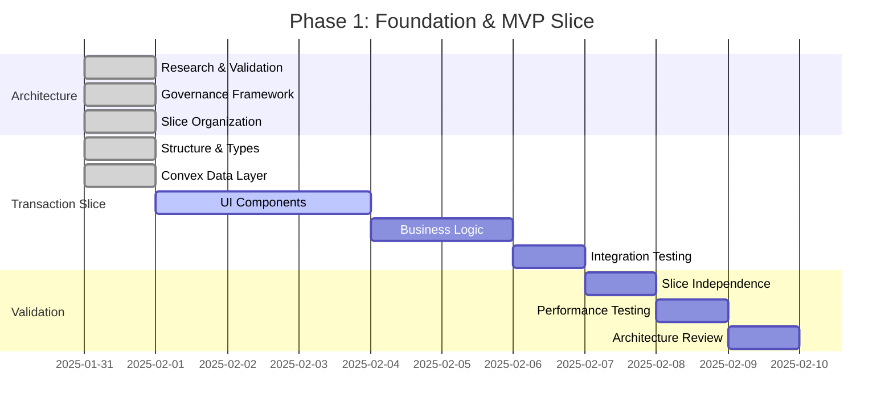
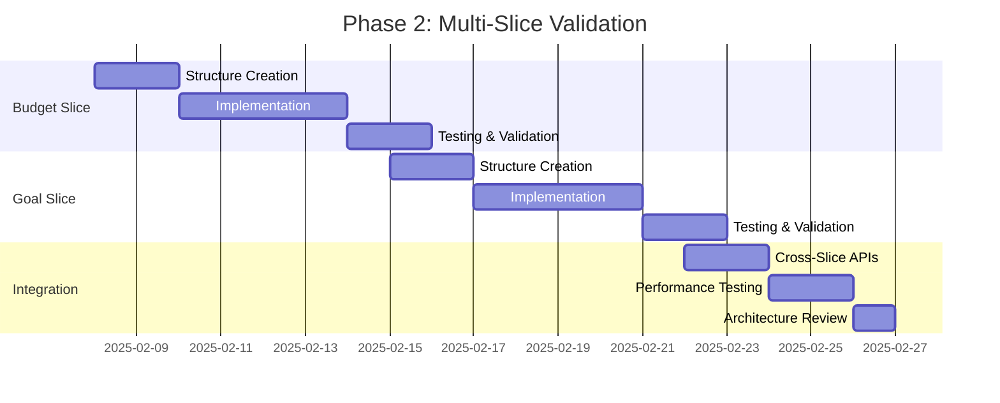
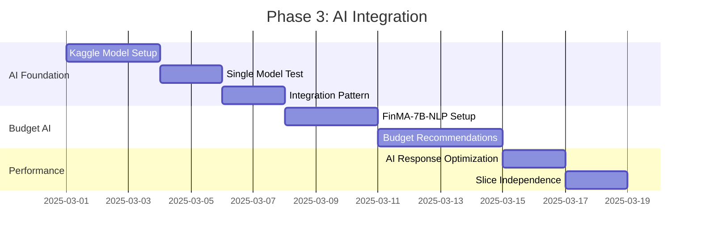
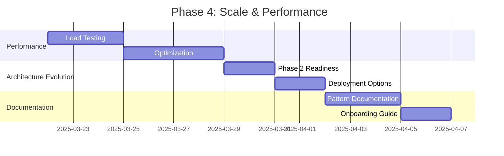

# Personal Finance App - Dynamic Project Roadmap

## 🎯 Project Overview
**Status**: Phase 1 - Architecture Foundation Complete  
**Architecture**: Atomic Vertical Slice Hybrid (Research-validated)  
**Last Updated**: 2025-01-31  
**Next Milestone**: Transaction Management Slice MVP  

---

## 📋 Current Status Dashboard

### ✅ Completed Milestones
- **Architecture Research** (2025-01-31)
  - ✓ Gap-filled analysis with 61+ evidence sources
  - ✓ Theory validated: "Feasible with Modifications" 
  - ✓ Research gaps identified and filled
  - ✓ Implementation strategy defined

- **Governance Framework** (2025-01-31)
  - ✓ Integrated governance system created
  - ✓ 7 governance files interconnected
  - ✓ Daily workflow procedures established
  - ✓ Quality gates and compliance framework

- **Architecture Foundation** (2025-01-31)
  - ✓ Vertical slice organization implemented
  - ✓ Transaction management slice structure created
  - ✓ Convex integration with atomic boundaries
  - ✓ Anti-over-engineering rules integrated

### 🔄 In Progress (Current Sprint)
- **Transaction Management Slice MVP** (Target: Week 1)
  - 🔄 UI components for transaction CRUD
  - 🔄 Business logic layer implementation
  - 🔄 Slice independence validation
  - ⏳ End-to-end feature completion

### 📅 Next Up (Upcoming Sprints)
- **Budget Tracking Slice** (Target: Week 2-3)
- **Architecture Pattern Validation** (Target: Week 3)
- **Goal Management Slice** (Target: Week 4)

---

## 🗺️ Complete Roadmap

### Phase 1: Foundation & First Slice (Current - Weeks 1-4)


#### 🎯 Phase 1 Goals
- **Primary**: Validate Atomic Vertical Slice Hybrid Architecture with working example
- **Secondary**: Establish development patterns and governance compliance
- **Success Criteria**: 
  - ✅ Complete transaction management feature
  - ✅ Slice independence validated
  - ✅ Sub-200ms performance achieved
  - ✅ Architecture pattern proven

### Phase 2: Pattern Replication (Weeks 5-8)


#### 🎯 Phase 2 Goals
- **Primary**: Prove architecture scales across multiple feature slices
- **Secondary**: Establish slice communication patterns
- **Success Criteria**:
  - ✅ 3 independent slices operational
  - ✅ Clean API boundaries maintained
  - ✅ No cross-slice business logic
  - ✅ Development velocity maintained

### Phase 3: AI Enhancement (Weeks 9-12)


#### 🎯 Phase 3 Goals
- **Primary**: Add AI capabilities while maintaining architecture integrity
- **Secondary**: Validate AI integration within slice boundaries
- **Success Criteria**:
  - ✅ Single AI model working (Budget specialist)
  - ✅ AI logic contained within slice
  - ✅ Performance maintained (<200ms)
  - ✅ Architecture boundaries preserved

### Phase 4: Scale Validation (Weeks 13-16)


#### 🎯 Phase 4 Goals
- **Primary**: Validate architecture at target scale (1000+ users)
- **Secondary**: Prepare for Phase 2 architecture evolution
- **Success Criteria**:
  - ✅ 1000+ user capacity validated
  - ✅ Phase 2 transition plan ready
  - ✅ Complete pattern documentation
  - ✅ Future developer onboarding system

---

## 🎮 Memory System Integration

### Automatic Roadmap Updates
```bash
# Triggered on every significant update
./scripts/update-roadmap.sh

# What gets updated automatically:
# 1. Completion status from CLAUDE.md progress
# 2. Current focus from active development  
# 3. Next priorities from governance decisions
# 4. Timeline adjustments from actual velocity
# 5. Architecture evolution triggers
```

### Memory-Driven Roadmap Sync
```bash
# Daily sync process
1. Read CLAUDE.md current status
2. Parse completed tasks and decisions
3. Update roadmap completion percentages
4. Adjust timelines based on velocity
5. Identify new requirements or changes
6. Update next sprint priorities
7. Refresh architecture evolution triggers
```

### Integration Points

#### From CLAUDE.md → PROJECT_ROADMAP.md
```bash
# Completed tasks update roadmap status
grep "✓" CLAUDE.md | ./scripts/update-completion.sh

# Current focus updates active milestone
grep "In Progress" CLAUDE.md | ./scripts/update-active.sh

# Decisions impact roadmap priorities
grep "Decision:" CLAUDE.md | ./scripts/update-priorities.sh
```

#### From Architecture Files → PROJECT_ROADMAP.md
```bash
# Scale triggers update phase transitions
grep "Phase.*triggered" ATOMIC_*_GOVERNANCE.md | ./scripts/check-phase-transition.sh

# Quality gates impact milestone completion
grep "Quality Gate.*failed" *_GOVERNANCE.md | ./scripts/update-blockers.sh
```

#### From Development Activity → PROJECT_ROADMAP.md
```bash
# Git commits update feature progress
git log --oneline --since="1 week ago" | ./scripts/update-velocity.sh

# File changes indicate active development areas
git diff --name-only HEAD~10 | ./scripts/update-active-areas.sh
```

---

## 👥 Future Developer Onboarding

### New Developer Quick Start

#### Day 1: Context Understanding
```bash
# 1. Project overview and current status
cat PROJECT_ROADMAP.md | head -50

# 2. Architecture understanding
cat ATOMIC_VERTICAL_SLICE_HYBRID_GOVERNANCE.md | grep -A 10 "Architecture Definition"

# 3. Development rules and constraints
cat PROJECT_RULES.md | grep -A 20 "Anti-Over-Engineering Rules"

# 4. Current progress and next steps
cat CLAUDE.md | grep -A 10 "Current Tasks"
```

#### Day 2: Hands-On Architecture
```bash
# 1. Explore slice organization
ls -la src/slices/
cat src/slices/README.md

# 2. Understand slice boundaries
cat src/slices/transaction-management/types/index.ts
cat frontend/convex/transactions.ts

# 3. Review governance integration
cat GOVERNANCE_SYSTEM.md | grep -A 10 "Daily Development Checklist"
```

#### Week 1: Development Readiness
```bash
# 1. Complete first feature following slice pattern
# 2. Validate architecture compliance using quality gates
# 3. Update roadmap with learning and progress
# 4. Ready for independent development
```

### Knowledge Transfer System

#### Architecture Knowledge
- **Theory Foundation**: Research documentation with 61+ evidence sources
- **Implementation Patterns**: Working examples in transaction management slice
- **Quality Standards**: Integrated governance with compliance checking
- **Evolution Strategy**: Clear triggers and transition plans

#### Development Patterns
- **Slice Organization**: Proven vertical slice structure
- **Anti-Over-Engineering**: Established rules and red flag detection
- **Integration Workflows**: Memory system and governance coordination
- **Performance Standards**: Sub-200ms targets with validation

#### Project History
- **Decision Trail**: Complete decision documentation in CLAUDE.md
- **Architecture Evolution**: Phase-based development with clear triggers
- **Learning Capture**: Lessons learned and pattern documentation
- **Success Metrics**: Quantifiable goals and achievement tracking

---

## 🔄 Roadmap Maintenance Automation

### Daily Updates (Automated)
```bash
#!/bin/bash
# Daily roadmap sync (cron job)

# 1. Update completion status from memory system
python scripts/sync-completion-status.py

# 2. Update active development areas
python scripts/sync-active-areas.py

# 3. Check for architecture evolution triggers
python scripts/check-evolution-triggers.py

# 4. Update timeline based on velocity
python scripts/update-timeline.py

# 5. Refresh next priorities
python scripts/refresh-priorities.py
```

### Weekly Reviews (Semi-Automated)
```bash
#!/bin/bash
# Weekly roadmap review (manual trigger)

# 1. Architecture health check
python scripts/architecture-health-check.py

# 2. Governance compliance review
python scripts/governance-review.py

# 3. Performance metrics update
python scripts/performance-review.py

# 4. Roadmap accuracy validation
python scripts/validate-roadmap-accuracy.py

# 5. Generate weekly report
python scripts/generate-weekly-report.py
```

### Monthly Evolution (Manual Review)
```bash
# Monthly strategic review
# 1. Phase completion assessment
# 2. Architecture evolution evaluation  
# 3. Roadmap accuracy and lessons learned
# 4. Strategic adjustments and priority updates
# 5. Future developer onboarding effectiveness
```

---

## 📊 Success Metrics & KPIs

### Development Velocity
- **Features Completed**: Target 1 slice per 2 weeks
- **Architecture Compliance**: >95% quality gate pass rate
- **Performance Standards**: <200ms slice operation response time
- **Code Quality**: <200 lines per file, slice independence maintained

### Architecture Validation
- **Slice Independence**: 0 cross-slice business logic violations
- **API Boundaries**: Clear interfaces between all slices
- **Evolution Readiness**: Phase transition criteria met
- **Pattern Replication**: New slices follow established patterns

### Project Health
- **Memory System Accuracy**: Roadmap reflects actual progress
- **Governance Effectiveness**: Rules preventing problems, not blocking progress
- **Developer Onboarding**: New developers productive within 1 week
- **Knowledge Transfer**: Complete project understanding possible from documentation

### Business Value
- **User Experience**: Complete feature delivery per slice
- **Performance**: Production-ready performance characteristics
- **Scalability**: Architecture supports target user load (1000+)
- **Innovation**: Atomic Vertical Slice Hybrid pattern validation and contribution

---

## 🎯 Current Focus (Auto-Updated)

### This Week's Priorities
1. **Complete Transaction Management Slice UI** (Priority 1)
   - Build CRUD interface components
   - Implement form validation and error handling
   - Test slice independence and performance

2. **Validate Architecture Pattern** (Priority 2)
   - Confirm slice boundaries are working
   - Test API interfaces between slice and app
   - Document any pattern adjustments needed

3. **Prepare Budget Slice Foundation** (Priority 3)
   - Define budget slice requirements
   - Plan slice structure following transaction pattern
   - Prepare for next sprint development

### Next Week's Preview
1. **Budget Tracking Slice Implementation**
2. **Cross-Slice Integration Testing**
3. **Architecture Pattern Documentation**

### Blockers & Risks
- None currently identified
- Weekly governance review will identify any emerging issues

---

*This roadmap is automatically maintained through integration with the memory system (CLAUDE.md), governance framework, and development activity. Every update to the project automatically refreshes relevant sections, ensuring future developers have current, accurate project context.*

## 🔧 Roadmap Update Commands

### Manual Updates
```bash
# Update completion status
./scripts/mark-complete.sh "milestone-name"

# Update current focus  
./scripts/update-focus.sh "new-priority-item"

# Add new milestone
./scripts/add-milestone.sh "Phase X" "milestone-name" "target-date"

# Architecture evolution trigger
./scripts/trigger-phase-transition.sh "Phase X"
```

### Integration Validation
```bash
# Check roadmap accuracy
./scripts/validate-roadmap.sh

# Sync with memory system
./scripts/sync-with-memory.sh

# Generate onboarding guide
./scripts/generate-onboarding.sh
```