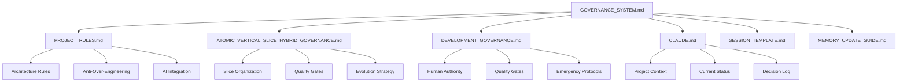

# Personal Finance App - Integrated Governance System

## 🎯 Master Control System
This file integrates all governance documents into a unified project management system.

---

## 📋 Document Hierarchy & Integration

### 🔗 Core System Files



### 📚 Document Responsibilities

| Document | Primary Role | Integration Points |
|----------|-------------|-------------------|
| **GOVERNANCE_SYSTEM.md** | Master coordinator, workflow orchestrator | All documents |
| **PROJECT_ROADMAP.md** | Dynamic roadmap, memory integration, future onboarding | CLAUDE.md, all governance files |
| **PROJECT_RULES.md** | Development constraints, architecture patterns | ATOMIC_*, DEVELOPMENT_*, ROADMAP |
| **ATOMIC_VERTICAL_SLICE_HYBRID_GOVERNANCE.md** | Architecture compliance, slice validation | PROJECT_RULES, DEVELOPMENT_*, ROADMAP |
| **DEVELOPMENT_GOVERNANCE.md** | Human authority, quality gates, escalation | All documents |
| **CLAUDE.md** | Project memory, context, decision history | All documents, auto-updates ROADMAP |
| **GOVERNANCE_QUICK_REFERENCE.md** | Daily commands, decision matrix | All governance files |
| **SESSION_TEMPLATE.md** | Session handoff, progress tracking | CLAUDE.md, DEVELOPMENT_*, ROADMAP |
| **MEMORY_UPDATE_GUIDE.md** | Memory maintenance, context preservation | CLAUDE.md, ROADMAP |

---

## 🔄 Integrated Workflows

### 1. Feature Development Workflow

#### Phase 1: Planning & Architecture Review
```bash
# Step 1: Check Current Context
Read: CLAUDE.md → Current status, architectural decisions
Read: PROJECT_ROADMAP.md → Current milestone and priorities
Read: PROJECT_RULES.md → Development constraints and patterns
Read: ATOMIC_VERTICAL_SLICE_HYBRID_GOVERNANCE.md → Architecture compliance

# Step 2: Validate Feature Scope
Check: Anti-over-engineering rules (PROJECT_RULES.md)
Validate: Slice boundaries (ATOMIC_*_GOVERNANCE.md)
Confirm: Roadmap alignment (PROJECT_ROADMAP.md)
Confirm: Human authority needed? (DEVELOPMENT_GOVERNANCE.md)
```

#### Phase 2: Implementation
```bash
# Step 3: Architecture Compliance
Apply: Vertical slice organization (ATOMIC_*_GOVERNANCE.md)
Follow: Code rules (PROJECT_RULES.md)
Implement: Quality gates (DEVELOPMENT_GOVERNANCE.md)

# Step 4: Quality Validation
Run: Architecture compliance checks
Validate: Slice independence tests
Check: Performance within slice
```

#### Phase 3: Completion & Documentation
```bash
# Step 5: Documentation Updates
Update: CLAUDE.md with decisions made
Update: PROJECT_ROADMAP.md with progress and completion
Record: Architecture patterns in governance files
Create: Session summary (SESSION_TEMPLATE.md)

# Step 6: Memory System Update
Run: ./scripts/update-roadmap.sh (automatic roadmap sync)
Follow: MEMORY_UPDATE_GUIDE.md process
Validate: Context consistency across files
```

### 2. Decision Making Workflow

#### When Rules Conflict
```bash
# Escalation Path (DEVELOPMENT_GOVERNANCE.md)
1. Document conflict clearly
2. Present options to human with pros/cons
3. Human decides which principle takes priority
4. Update appropriate governance file
5. Record decision in CLAUDE.md
```

#### Architecture Evolution Triggers
```bash
# Scale Decision Points (ATOMIC_*_GOVERNANCE.md + PROJECT_RULES.md)
Check: >1000 users? → Consider Phase 2 architecture
Check: >3 developers? → Review slice boundaries  
Check: Performance issues? → Validate current phase
Check: Slice conflicts? → Architecture review needed
```

### 3. Quality Gate Integration

#### Pre-Development Gates
- [ ] **PROJECT_RULES.md**: Anti-over-engineering validation
- [ ] **ATOMIC_*_GOVERNANCE.md**: Architecture compliance check
- [ ] **DEVELOPMENT_GOVERNANCE.md**: Human approval if needed
- [ ] **CLAUDE.md**: Context understanding validated

#### During Development Gates
- [ ] **Slice Independence**: No cross-slice business logic
- [ ] **Boundary Compliance**: Clear API interfaces
- [ ] **Performance**: Sub-200ms slice operations
- [ ] **Anti-Patterns**: No red flags from PROJECT_RULES.md

#### Post-Development Gates
- [ ] **Documentation**: CLAUDE.md updated with decisions
- [ ] **Session Recording**: SESSION_TEMPLATE.md completed
- [ ] **Memory Consistency**: All files reflect current state
- [ ] **Architecture Evolution**: Scale triggers evaluated

---

## 🎮 Operational Procedures

### Daily Development Checklist

#### Morning Startup
```bash
1. Run ./scripts/quick-status.sh → Get complete project overview
2. Read PROJECT_ROADMAP.md → Check current milestone and priorities
3. Read CLAUDE.md → Understand current project state
4. Review PROJECT_RULES.md → Remember constraints and patterns
5. Check ATOMIC_*_GOVERNANCE.md → Validate architecture compliance
6. Review pending items from last SESSION_TEMPLATE.md
```

#### During Development
```bash
1. Follow vertical slice organization (ATOMIC_*_GOVERNANCE.md)
2. Apply anti-over-engineering rules (PROJECT_RULES.md)
3. Validate quality gates (DEVELOPMENT_GOVERNANCE.md)
4. Document decisions in real-time
```

#### End of Day
```bash
1. Update CLAUDE.md with progress and decisions
2. Run ./scripts/update-roadmap.sh → Sync progress to roadmap
3. Complete SESSION_TEMPLATE.md for session handoff
4. Check governance file updates needed
5. Run final architecture compliance check
```

### Weekly Review Process

#### Architecture Health Check
```bash
1. Review slice independence (ATOMIC_*_GOVERNANCE.md)
2. Check anti-over-engineering compliance (PROJECT_RULES.md)
3. Validate quality gate effectiveness (DEVELOPMENT_GOVERNANCE.md)
4. Update memory system (MEMORY_UPDATE_GUIDE.md)
```

#### Governance System Maintenance
```bash
1. Check file consistency across all MD files
2. Update cross-references as project evolves
3. Refine rules based on actual experience
4. Document lessons learned in appropriate files
```

---

## 🚨 Emergency Protocols Integration

### Red Flag Detection System
When any governance file detects violations:

#### From PROJECT_RULES.md (Over-engineering detected)
```bash
1. STOP development immediately
2. Reference DEVELOPMENT_GOVERNANCE.md emergency protocols
3. Document issue in CLAUDE.md 
4. Apply anti-over-engineering remediation
5. Update governance if new pattern discovered
```

#### From ATOMIC_*_GOVERNANCE.md (Architecture violation)
```bash
1. STOP feature development
2. Assess slice boundary violation impact
3. Apply architecture remediation patterns
4. Document in CLAUDE.md decision log
5. Update PROJECT_RULES.md if needed
```

#### From DEVELOPMENT_GOVERNANCE.md (Quality gate failure)
```bash
1. Escalate to human decision maker
2. Document failure and options in CLAUDE.md
3. Apply rollback procedures if needed
4. Update appropriate governance files
5. Create prevention measures
```

### Recovery Procedures
```bash
# Immediate Recovery
1. Stop all development work
2. Assess damage across all governance domains
3. Determine rollback vs fix-forward strategy
4. Get human decision on approach
5. Execute recovery plan

# Post-Recovery
1. Update all affected governance files
2. Document lessons learned in CLAUDE.md
3. Create prevention measures
4. Validate governance system effectiveness
```

---

## 🔧 File Integration Commands

### Quick Status Check
```bash
# Get complete project status (recommended)
./scripts/quick-status.sh

# Manual status checks
cat PROJECT_ROADMAP.md | head -30
cat CLAUDE.md | grep "Current Tasks"
cat PROJECT_RULES.md | grep "Red Flags"
cat ATOMIC_*_GOVERNANCE.md | grep "Quality Gates"
cat DEVELOPMENT_GOVERNANCE.md | grep "Emergency"
```

### Governance Validation
```bash
# Check file consistency
grep -r "CLAUDE.md" *.md
grep -r "PROJECT_RULES" *.md
grep -r "ATOMIC_" *.md
grep -r "DEVELOPMENT_" *.md
```

### Decision Documentation
```bash
# Update decision across system
1. Record in CLAUDE.md decision log
2. Update PROJECT_RULES.md if pattern change
3. Update ATOMIC_*_GOVERNANCE.md if architecture change
4. Update DEVELOPMENT_GOVERNANCE.md if process change
5. Create SESSION_TEMPLATE.md entry
```

---

## 📊 Success Metrics

### Governance System Health
- **File Consistency**: All cross-references valid
- **Decision Traceability**: Every decision documented
- **Rule Effectiveness**: Rules preventing problems
- **Process Efficiency**: Governance enabling, not blocking

### Integration Effectiveness
- **Workflow Clarity**: Clear next steps always available
- **Conflict Resolution**: Fast escalation and resolution
- **Knowledge Retention**: Context preserved across sessions
- **Quality Maintenance**: Consistent quality standards

### Project Success Indicators
- **Feature Velocity**: Features delivered per timeframe
- **Quality Metrics**: Bugs, performance, user satisfaction
- **Architecture Health**: Slice independence maintained
- **Team Productivity**: Governance helping, not hindering

---

## 🎯 Master Governance Checklist

### Before Any Development Work
- [ ] **Context Check**: Read CLAUDE.md current status
- [ ] **Rule Review**: Understand PROJECT_RULES.md constraints
- [ ] **Architecture Validation**: Check ATOMIC_*_GOVERNANCE.md compliance
- [ ] **Human Authority**: Check if DEVELOPMENT_GOVERNANCE.md escalation needed

### During Development
- [ ] **Slice Organization**: Follow vertical slice patterns
- [ ] **Anti-Over-Engineering**: Apply PROJECT_RULES.md principles  
- [ ] **Quality Gates**: Meet DEVELOPMENT_GOVERNANCE.md standards
- [ ] **Real-time Documentation**: Update decisions as made

### After Development
- [ ] **Memory Update**: Update CLAUDE.md with progress
- [ ] **Session Documentation**: Complete SESSION_TEMPLATE.md
- [ ] **Governance Maintenance**: Update affected MD files
- [ ] **System Validation**: Run integrated compliance check

---

## 🚀 Evolution Strategy

### As Project Grows
The governance system itself evolves with the project:

#### Phase 1 (Current): Foundation
- All MD files established and integrated
- Basic workflow procedures working
- Human-in-the-loop decision making active

#### Phase 2 (Growth): Automation  
- Automated governance checking tools
- Integration with development tools (git hooks, CI/CD)
- Enhanced workflow automation

#### Phase 3 (Scale): Sophistication
- Advanced metrics and monitoring
- Predictive governance recommendations
- Full integration with development ecosystem

### Continuous Improvement
- Weekly governance effectiveness review
- Monthly file integration validation
- Quarterly governance system evolution
- Annual governance architecture review

---

*This integrated governance system ensures all MD files work together as a unified project management and quality assurance framework, maintaining the innovative Atomic Vertical Slice Hybrid Architecture while preventing over-engineering and ensuring human authority in all decisions.*